# Web-App 应用的基础模块设计

##### 一个应用的基础模块，如下：
- [用户中心](#user)，认证登录、黑名单屏蔽
- [消息系统](#message)，用户私信、客服消息
- [内容管理](#explore)，编辑精选、官方公告等
- [评论点赞](#comment)，对内容评论、对评论点赞

##### 基于性能，以及运维成本考虑，会用到：
- 亚马逊的 [DynamoDB](#dynamodb)（MongoDB 亦可）
- [Mysql](#mysql) 的 Hash 分表
- 按用途多开 [Redis](#redis) 进程

##### 附加
- [前端 React 加载页面逻辑](#loading)

##### 代码
- 前端 [React-native](https://github.com/tanliang/slimmee)
- 后端 [PHP](https://github.com/tanliang/tl_php)

> ##### 示例
> - 用户能发布职位、简历信息，即为“Boss直聘”；
> - 发布二手买卖信息，即为“闲鱼”；
> - …
>
> 
>
> 
>

# 基础模块

## 用户中心
用户中心存储用户数据，并执行登录认证。使用2个数据库，Auth 库用于保存登录字段与用户 ID（uid）关联，User 库保存用户基本信息。

### Auth 库
Auth 库表只有2个字段 name, uid，其中以 name 为_唯一_ hash 值**分表**，支持 third_id（第三方登录）、email、nickname、phone 等登录。以 email 验证为例：

1. 用户填写 email 信息
2. 点击"获取"得到验证码，后续亦可作为登录密码

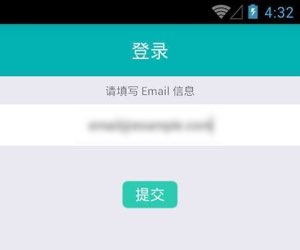

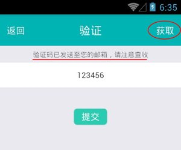

~~~php
class User extends Ext_Model_Hash
{
	public function chkCaptcha($device, $email, $pass)
	{
	    $res = '';
	    $key = $this->keyCaptcha($email);
	    $val = intval($this->cls_redis->get($key));
	    // app有"获取"动作，且正确的，更新数据库 pass
	    if ($val == $pass) {
	        // add/update user info
	        $auth = new Auth($email);
	        if ($auth->uid) {
	            $user = new User($auth->uid);
	            $user->pass = sha1($pass);
	            $user->device = $device;
	            if ($user->uid) {
	                if ($user->update()) {
	                    $res = $user->uid;
	                }
	            } else {
	                $user->uid = $auth->uid;
	                $user->email = $email;
	                $res = $this->addUser($user);
	            }
	        } else {
	            $auth->name = $email;
	            $auth->uid = $this->genUid();
	            if ($auth->insert()) {
	                $user = new User($auth->uid);
	                $user->uid = $auth->uid;
	                $user->pass = sha1($pass);
	                $user->device = $device;
	                $user->email = $email;
	                $res = $this->addUser($user);
	            }
	        }
	        if (!empty($res)) {
	            $this->cls_redis->del($key);
	        }
	    } else {
	        // 没"获取"动作，只验证数据库pass
	        // check user 
	        $auth = new Auth($email);
	        if ($auth->uid) {
	            $user = new User($auth->uid);
	            if (sha1($pass) == $user->pass) {
	                $user->device = $device;
	                if ($user->update()) {
	                    $res = $user->uid;
	                }
	            }
	        }
	    }
	    return $res;
	}
}
~~~

### User 库
以 uid 为_唯一_ hash 值**分表**，并存储用户相关属性。uid 可以简单的用时间戳转换，并检查唯一性，如：

~~~php
class User extends Ext_Model_Hash
{
	public function genUid()
	{
	    do {
	        list($micro, $sec) = explode(' ', microtime());
	        $rnd = intval($micro * 1000);
	        $uid = $this->num2str($sec).$this->num2str($rnd);
	        $user = new User($uid);
	    } while ($user->uid);
	    
	    return $uid;
	}
	
	public function num2str($num) 
	{
	    $ns_base = '0123456789ABCDEFGHIJKLMNOPQRSTUVWXYZ';
	    $len = strlen($ns_base);
	    $result = '';
	    do {
	        $result = $ns_base[$num % $len] . $result;
	        $num = intval($num / $len);
	    } while ($num != 0);
	    
	    return $result;
	}
}
~~~

## 消息系统
因为不是即时通讯应用，所以用 redis 作为消息系统的存储，主要用作用户私信，以及客服消息，客户端主动拉取，并有举报机制，如有必要可在客户端 [dialog](#dialog) 页面轮询拉取，仿即时通讯效果。基本格式如下：

~~~php
class Message_Controller extends Ext_Api_Auth_Redis
{       
	/**
	 * 
	 * @param string $cate enum=[dialog(/reply), comment(/comment_edit), review]
	 * @param string $content show on Notifications
	 * @param string $from nickname
	 * @return int 0=fail, or timestamp
	 */
	public function sendMessage($target_uid, $cate, $content, $time=0)
	{
	    $message = new Message($target_uid);
	    $from = $this->user->nickname;
	    $uid = $this->user->uid;
	    $data = compact('cate', 'content', 'from', 'uid');
	    if ($time == 0) {
	        $time = time();
	    }
	    $res = $message->add(serialize($data), $time);
	    if ($res) {
	        $res = $time;
	    }
	    return $res;
	}
	
	// $message->add($val, $score);
	public function add($val, $score='')
	{
	    if (empty($score)) {
	        $score = time();
	    }
	    return $this->_redis->zAdd($this->_key, $score, $val);
	}
}
~~~

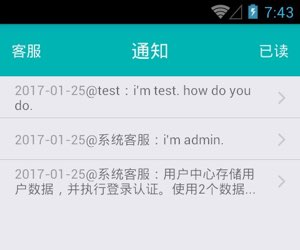

### cate 参数
- dialog 对话消息，主要用于系统客服，以及用户私信信息展示。
- comment 评论消息，作者可以回复、审核
- review 审核消息，同评论消息，只展示，无输入框。

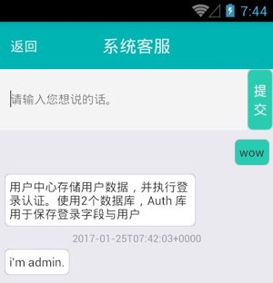

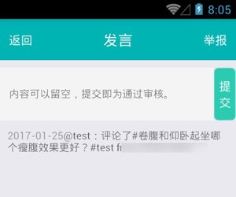

### 举报
从评论列表选择私信，以及作者审核用户评论都可以举报（加入黑名单），举报会自动给后台“系统客服”发送通知消息，并每累计3次，增加禁言一天。举报关系亦用 redis 存储。

~~~php
class Banned_Controller extends Ext_Api_Auth_Redis_Rank
{
    public function addAction()
    {
        $target_user = new User($this->target_val);
        if (empty($target_user->uid)) {
            $this->output(103);
        }
        
        parent::addAction();
        
        if ($this->result['ok'] !== false) {
            $report = TL_Tools::safeInput('report');
            $message = TL_Tools::safeInput('message');
            if (!empty($message)) {
                $message = '因为['.$report.']举报'.$target_user->nickname.'：'.$message;
                $this->sendMessage('admin', 'dialog', $message);
            }
            // banned % 3 ,inavtive user * 24 hours
            if ($this->result['ok'] % 3 == 0) {
                $target_valid = $target_user->valid;
                $date = date('Y-m-d');
                if ($target_valid < $date) {
                    $target_valid = $date;
                }
                $target_user->valid = date('Y-m-d', strtotime($target_valid) + 24 * 3600);
                $target_user->update();
            }
        }
        $this->result['ok'] = 1;
    }
}
~~~

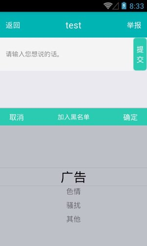

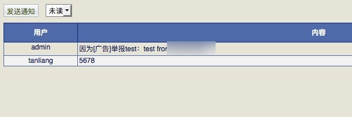

## 内容管理
普通的 cms 内容管理。客户端 *Loading* 时，加载新文章列表，文章详情通过中继 Relay 获取，跳转展示内容，并在内容页加载评论。其他无特殊处理，略。

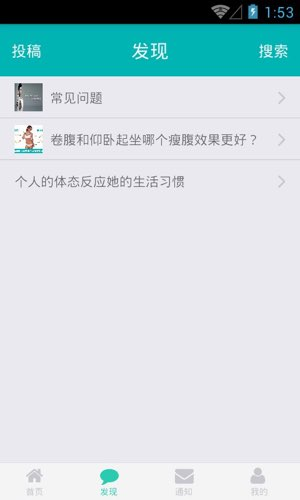

## 评论点赞
用户可对文章发表评论，并给[评论点赞](#comment-show)，获取评论列表时，评论内容可以缓存，但赞数，以及当前用户对当前文章评论是否点赞则需*即时更新*。

~~~php
class User_Controller extends Ext_Api_Auth
{
    public function commentAction()
    {
        $limit = TL_Tools::safeInput('limit', 'digit');
        if ($limit < 1 || $limit > 30) {
            $this->output(103);
        }
        $page = TL_Tools::safeInput('page', 'digit');
        if ($page < 1) {
            $page = 1;
        }
        $id = TL_Tools::safeInput('id', 'digit');

        $hash_id = 'ca'.$id;
        $data = new Data($hash_id);
        $params = array(
            'hash_id' => $hash_id,
            'limit' => $limit,
            'page' => $page
        );
        $all = $data->getAllByCache($params, 3600);
        
        // add dynamic agree number to cache comment
        $user_agree = array();
        $d2 = new Data('ac'.$id);
        $res = $d2->getListByParams(array(
            'hash_id' => 'ac'.$id,
            'memo' => $this->user->uid
        ), null, null);
        if (!empty($res)) {
            foreach ($res as $v) {
                $user_agree[] = $v['uid'].$v['time_add'];
            }
        }
        
        $agree = new Agree($hash_id);
        foreach ($all as $k => $v) {
            $all[$k]['agree_number'] = intval($agree->score($v['key']));
            $all[$k]['agree_done'] = in_array($v['key'], $user_agree);
        }

        $this->result = array(
            'ok' => 1,
            'data' => $all
        );        
    }
}
~~~

### DynamoDB 库 comment 表
用亚马逊的 DynamoDB，分区键 uid，排序键 time_add，表示用户在某刻的行为。

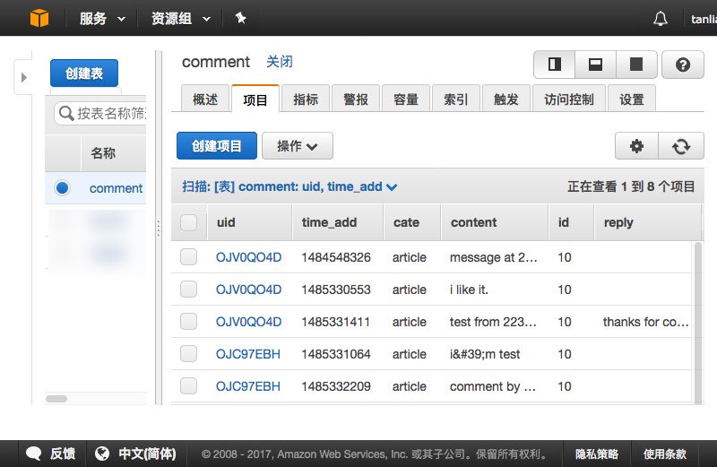

### Data 库
Data 库分表用于存放文章评论、点赞*关系*，data 分表字段如下：

- *hash_id*，分区键，非唯一
- *uid*，对应 comment 表 uid
- *time_add*，对应 comment 表 time_add
- *memo*，备注

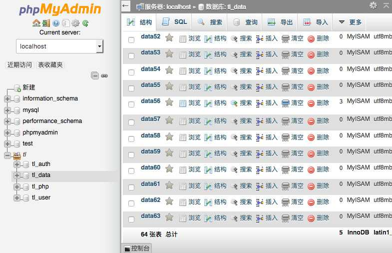

### 评论
Data 库表字段 *hash_id* 如：ca10，表示 *uid* 在 *time_add* 对文章10的评论，内容对应亚马逊 DynamoDB 库 comment 表。*memo* 字段默认为空，审核后为即刻时间戳。

评论默认按时间倒序，可手动选择*按赞数排序*。

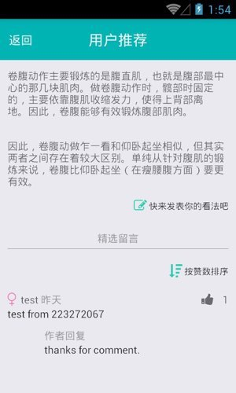

### 点赞
Data 库表字段 *hash_id* 如：ac10，表示对 *uid* 在 *time_add* 文章10评论的点赞。*memo* 字段为点赞用户 *uid*。点赞计数存入 redis，并可*按赞数排序*。

~~~php
class User_Controller extends Ext_Api_Auth
{
    public function agreeAction()
    {
        $time_add = TL_Tools::safeInput('time_add', 'digit');
        $id = TL_Tools::safeInput('id', 'digit');
        $uid = TL_Tools::safeInput('uid');
        
        $hash_id = 'ac'.$id;
        $params = array(
            'hash_id' => $hash_id,
            'uid' => $uid,
            'time_add' => $time_add,
            'memo' => $this->user->uid 
        );
        $data = new Data($hash_id);
        $item = $data->getItemByParams($params);
        
        $res = 0;
        if (empty($item)) {
            $data->fromArray($params);
            if ($data->insert()) {
                $res = 1;
            }
        } else {
            if($data->delByParams($params)) {
                $res = -1;
            }
        }
        
        if ($res != 0) {
            $agree = new Agree('ca'.$id);
            $agree->incr($uid.$time_add, $res);
        }
        
        $this->result = array(
            'ok' => 1,
            'data' => array(
                'key' => $uid.$time_add,
                'val' => $res
            )
        );
    }
}
~~~

# 性能考虑

## DynamoDB
基于运维成本考虑，使用亚马逊的 DynamoDB 存储用户在某刻的行为数据，分区键为 uid，排序键 time_add，适用一次写入针对一个用户，性能要求不高的操作，如需考虑高性能，亦可搭建本地 mongodb。

## Mysql
本例中 Auth 库、User 库、Data 库，均用到 Mysql 的 hash 分表，其中 Data 库表的 hash_id 字段非唯一。后台示例代码如下：

~~~php
class Ext_Model_Hash extends Ext_Model
{
    protected $cls_num_tbl = 128;
    
    public function __construct($identifier=false)
    {
        if (!empty($identifier)) {
            $mod_tbl = Ext_Tools::getMod($identifier, $this->cls_num_tbl);
            $this->cls_tbl .= $mod_tbl;
        }
        parent::__construct($identifier);
    }
    
    public function tblInit()
    {
        list($db, $tbl) = explode('.', $this->cls_tbl);
        $config = $this->getDbConfig('default');
        if (!empty($config)) {
            for ($i=0; $i<$this->cls_num_tbl; $i++) {
                $sql = 'CREATE TABLE '.$this->cls_tbl.$i.' LIKE '.$config['name'].'.example_'.$tbl;
                $this->rawExecute($sql);
            }
        }
    }
}
~~~

因数据库位于服务器自身，并辅以 Redis 缓存，性能稍好。

~~~php
class Ext_Model extends TL_Model
{
    protected $cls_dbname = 'default';
    protected $cls_dbtype = 'mysql';
    protected $cls_cache; 
    
    /* 扩展 Model 以期使用数据库 */
    public function __construct($identifier=null)
    {
        $message = 'Db configure file not exists or fail to find <'.$this->cls_dbname.'> on configure file.';
        $config = $this->getDbConfig($this->cls_dbname);
        if (!empty($config)) {
            $this->cls_db = TL_Db::getInstance($this->cls_dbtype, $config);
            $this->cls_tbl = $config['name'].'.'.$this->cls_tbl;
        } 
        if ($this->cls_db == null) {
            $message = 'Db '.$this->cls_dbtype.'@'.$this->cls_dbname.': '.$message;
            if ($suffix != 'online') {
                throw new Exception($message);
            } else {
                error_log($message);
            }
        }
        
        $this->cls_cache = TL_Cache::getInstance();
        
        parent::__construct($identifier);
    }
    
    public function getItemByCache($identifier)
    {
        if (empty($identifier)) {
            return false;
        }
        // related to postEdit
        $func = 'getItemByParams';
        $params = array($this->cls_identifier=>$identifier);
        return $this->getByCache($func, $params);
    }
    
    protected function getByCache($func, $params=null, $ttl=0)
    {
        $key = $this->cls_tbl.':'.md5(serialize($params));
        $val = $this->cls_cache->get($key);
        if (!$val) {
            $val = $this->$func($params);
            $this->cls_cache->set($key, $val);
            if ($ttl > 0) {
                $this->cls_cache->ttl($key, $ttl);
            }
        }
        return $val;
    }
}
~~~

## Redis
按用途多开 Redis 进程，亦可后续根据进程负载重新规划，如：消息服务 Redis 负载高，可以单独用台服务器。

~~~php
class Ext_Model_Redis
{
    protected $_cls;
    protected $_redis;
    protected $_key;
    
    public function __construct($key)
    {
        $this->_cls = strtolower(get_class($this));
        $this->_redis = TL_Redis::getInstance($this->_cls);
        if (empty($key)) {
            throw new Exception('Empty key for '.$this->_cls);
        }
        $this->_key = $this->_cls.':'.$key;
    }
}
~~~

# 附加

## 前端页面加载逻辑

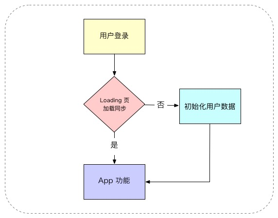

~~~react-native
import ...

export class Loading extends Component {
  constructor(props) {
    super(props);
    this.props = props;
    this.record = new ModelRecord();
    this.misc = new ModelMisc();
    this.state = {
      retry: 0
    };
  }

  componentDidMount() {
    this.updateList(this.props);
  }

  componentWillReceiveProps(newProps) {
    this.updateList(newProps);
  }

  updateList(props) {
    const token = this.misc.getCache('cfg_token');
    if (token == '') {
      nativeHistory.replace('/login')
    } else {
      if (this.misc.getCache('cfg_weight') == '') {
        this.misc.sync(this.handleUser.bind(this), 'user/get/');
        Toast.show("正在获取用户信息", {
          position: Toast.positions.CENTER
        });
      } else {
        this.handleUser({
          success: 1
        });
      }
    }
  }

  handleUser(responseJson) {
    if (responseJson.success == 0) {
      if (this.state.retry < 3) {
        this.misc.sync(this.handleUser.bind(this), 'user/get/');
        Toast.show("重新获取用户信息", {
          position: Toast.positions.CENTER
        });
        this.setState({
          retry: this.state.retry + 1
        });
      } else {
        Toast.show(responseJson.data, {
          position: Toast.positions.CENTER
        });
      }
    } else {
      if (responseJson.data != undefined) {
        for (let idx in responseJson.data) {
          this.misc.setCache('cfg_' + idx, responseJson.data[idx]);
        }
      }

      this.setState({
        retry: 0
      });
      const record_get = this.misc.getCache('cfg_record_get');
      if (record_get != '1' && this.misc.getCache('cfg_weight') != '') {
        this.misc.sync(this.handleRecord.bind(this), 'record/get/', {}, true, 15000);
        Toast.show("正在获取用户记录", {
          position: Toast.positions.CENTER
        });
      } else {
        this.handleRecord({
          success: 1
        });
      }

    }
  }

  handleRecord(responseJson) {
    if (responseJson.success == 0) {
      if (this.state.retry < 3) {
        this.misc.sync(this.handleRecord.bind(this), 'record/get/', {}, true, 15000);
        Toast.show("重新获取用户记录", {
          position: Toast.positions.CENTER
        });
        this.setState({
          retry: this.state.retry + 1
        });
      } else {
        Toast.show(responseJson.data, {
          position: Toast.positions.CENTER
        });
      }
    } else {
      this.misc.setCache('cfg_record_get', '1');
      if (responseJson.data != undefined) {
        for (let idx in responseJson.data) {
          let item = responseJson.data[idx];
          item.sync = 1;
          this.record.add(item);
        }
      }

      this.sync = this.record.raw().filtered('upd = 0');
      if (this.sync.length > 0) {
        this.misc.sync(this.handleSync.bind(this), 'record/sync/', {
          data: this.sync
        });
        Toast.show("正在同步用户记录", {
          position: Toast.positions.CENTER
        });
      } else {
        this.handleSync({
          success: 0
        });
      }
    }
  }

  handleSync(responseJson) {
    if (responseJson.success == 1) {
      this.record.upd(this.sync);
    }
    const article_upd = this.misc.getCache('cfg_article_upd');
    this.misc.sync(this.handleMessage.bind(this), 'message/latest/', {article_upd});
  }
  
  handleMessage(responseJson) {
    if (responseJson.success == 1) {
      if (responseJson.data.notify.length > 0) {
        let message = new ModelMessage();
        let data = responseJson.data.notify;
        let list = [];
        for (let i = 0; i < data.length; i++) {
          let item = data[i];
          item.content = decode_html_entity(item.content);
          list.push(item);
        }
        message.add(list);
        message.setCache('cfg_notify', '1');
      }
      if (responseJson.data.explore.length > 0) {
        let data = responseJson.data.explore;
        let explore = new ModelExplore();
        let article_upd = '';
        let article = [];
        for (let i = 0; i < data.length; i++) {
          let item = data[i];
          article.push({data: JSON.stringify(item), id: item.id});
          if (item.date_upd > article_upd) {
            article_upd = item.date_upd;
          }
        }
        if (article_upd != '') {
          explore.add(article);
          explore.setCache('cfg_article_upd', article_upd);
        }
        explore.setCache('cfg_explore', '1');
      }
    }

    let go = '/config';
    if (this.misc.getCache('cfg_weight') != '') {
      go = '/home';
    }
    nativeHistory.replace(go);
  }
  
  render() {
    
    const windowWidth = Dimensions.get('window').width;
    const windowHeight = Dimensions.get('window').height;

    return (
      <Image source={require('../../res/index.png')} style={{width: windowWidth, height: windowHeight}} resizeMode="stretch"/>
    );
  }
}
~~~