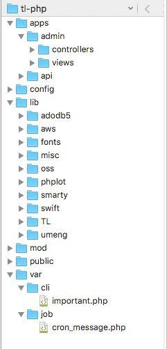

# tl_php (Web)管理后台设计要点

tl_php 后台是一个从08年开始自研 MVC 框架，功能从最初的简单 CMS 建站工具，不断调整，至此算初步完善，在开发新项目时，能达到事半功倍的效果，希望对大家有所帮助。

- [目录结构](#dir)，url重写规则介绍
- [使用准备](#config)，sql导入，后台访问
- 权限控制，新增管理员
- 视图模块，视图widget
- 缓存加载，pd主动加载，mod被动调用
- 简单搜索，替代 SQL 的 like 查询
- 分表分库，hash，自动脚本
- 关于云服务（S3、DynamoDB）

*ps: 此文档只讲设计思想，具体实现请参考[代码](https://github.com/tanliang/tl_php)。*

## 目录结构

tl_php 是一个 MVC 模式的功能代码合集，目录结构如下：

- apps 模块目录，默认二级域名访问，对应 apps 目录下的模块名称，如： admin.tl.dev。IP 访问则一级 URL 值为模块名称，如：127.0.0.1/admin
- 配置目录 config 放置数据存储相关，分为 *local* (本地服), *test* (测试服), *online* (正式服)，目录下 test 文件默认为空，如有值且于当前访问 $_SERVER['HTTP_HOST'] 相同，则加载 *test* 配置信息
- lib 目录放置核心功能库 TL，及各种第三方库
- mod 目录放置具体，及扩展业务逻辑
- public 作为入口目录，配置 apache 或 nginx 时，均指向此
- var/cli/important.php 为数据库库分表初始化脚本，var/job/cron_message.php 为自动执行获取客服信息脚本。 
- URL 重写访问，如：http://admin.tl.dev/auth/login， 或 URL 参数访问，如：http://admin.tl.dev/?controller=auth&action=login& 均可。

## 使用准备

开发环境可以用 XAMPP，先 phpmyadmin 导入 tl_github.sql.gz，再编辑 httpd-vhosts.conf ，如：

~~~apache
<VirtualHost *:80>
    DocumentRoot "/your path/tl-php/public"
    ServerName tl.dev
    ServerAlias api.tl.dev admin.tl.dev
    ErrorLog "logs/tl.dev-error.log"
    ##CustomLog "logs/dummy-host.example.com-access.log" common
    <Directory "/your path/tl-php/public">
        Options FollowSymLinks
        AllowOverride All
        Require all granted

        RewriteEngine on
        RewriteRule !\.(js|ico|gif|jpg|png|css|htm|txt|doc)$ index.php
    </Directory>
</VirtualHost>
~~~

最后编辑 /etc/hosts，把 tl.dev 相关域名执行本地 127.0.0.1 即可。

生产环境用 nginx，参考配置如下：

~~~nginx
server {
    listen       80;
    server_name  api.tl.com;
    error_log 	logs/error.log;
    root /your path/public;

    location / {
        index  index.html index.htm index.php;
        if ( !-e  $request_filename ) {
            rewrite ^/(.*)$ /index.php?$1 last;
        }
    }
  
	...
}
~~~

启用 Redis 服务，并配置 config 目录下对应文件 config/json/redis/local 。因为 article 图片上传到 S3，还需配置 config/define.php 的 AWS 相关。

*打开浏览器，使用 phpmyadmin 创建 tl_user, tl_auth, th_data 三个数据库，并修改执行 php -f var/cli/important.php 命令行脚本，初始化分表操作。*

最后，在浏览器地址栏输入 http://admin.tl.dev 进入后台，默认用户名/密码均为 admin

## 权限控制

因为使用了 MVC 模式，把 Controller 定义为一个功能集合体 ，每个 Action 为权限控制单位，默认 *list*(查看)、*add*（新增)、*edit*(编辑) 三个 Action 权限。

~~~php
abstract class Ext_Admin extends TL_Controller
{
    public $actions = array(
        /**
         * 当前控制器的动作属性集 由子类覆盖 用以确定 执行动作的权限 格式如下
         * 有tab表示将出现在tab菜单
         * auth表示动作权限 真 = 表示该动作需要权限 并验证会员权限列表是否有此ID
         */
        'list'      => array('name' => '管理', 'tab' => '管理', 'auth' => true),
        'add'       => array('name' => '新增', 'tab' => NULL, 'auth' => true),
        'edit'      => array('name' => '编辑', 'tab' => NULL, 'auth' => true),
        );
	...
}
~~~

亦可根据需要，对 Action 自行定义。

~~~php
class Article_Attachment_Controller extends Ext_Admin
{
    public $actions = array(
        'add'      => array('name' => '新增文章附件', 'tab' => NULL, 'auth' => false),
        'edit'     => array('name' => '编辑文章附件', 'tab' => NULL, 'auth' => false),
        'del'      => array('name' => '删除文章附件', 'tab' => NULL, 'auth' => false),
        );
	...
}
~~~

最终效果，如图：