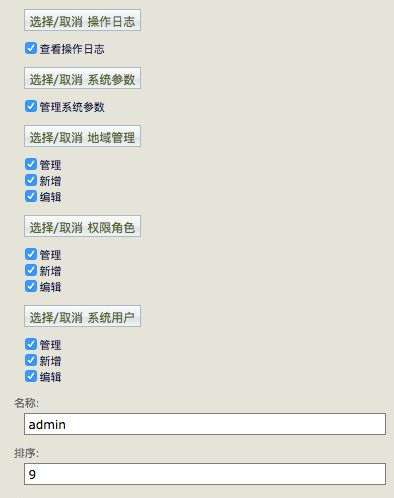
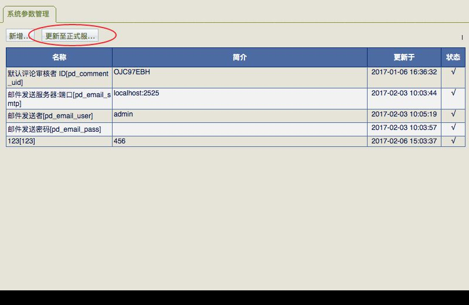
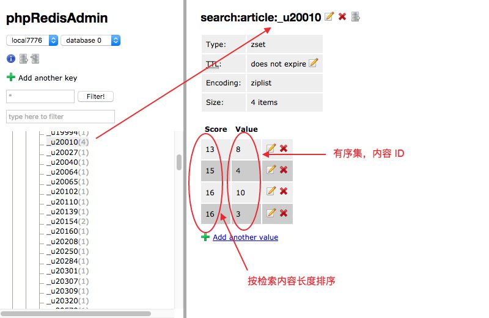

# tl_php (Web)管理后台设计要点

tl_php 后台是一个从08年开始自研 MVC 框架，功能从最初的简单 CMS 建站工具，不断调整，至此算初步完善，在开发新项目时，能达到事半功倍的效果，希望对大家有所帮助。

- [目录结构](#dir)，url重写规则介绍
- [使用准备](#config)，sql导入，后台访问
- [权限控制](#privilege)，mvc 映射
- [视图模块](#view)，自动生成 UI
- [缓存加载](#cache)，pd主动加载，mod被动调用
- [简单搜索](#search)，替代 SQL 的 like 查询
- [分表分库](#hash)，hash，自动脚本
- [关于云服务](#cloud)（S3、DynamoDB）

*ps: 此文档只讲设计思想，具体实现请参考[代码](https://github.com/tanliang/tl_php)。*

## 目录结构

tl_php 是一个 MVC 模式的功能代码合集，目录结构如下：

- apps 模块目录，默认二级域名访问，对应 apps 目录下的模块名称，如： admin.tl.dev。IP 访问则一级 URL 值为模块名称，如：127.0.0.1/admin
- 配置目录 config 放置数据存储相关，分为 *local* (本地服), *test* (测试服), *online* (正式服)，目录下 test 文件默认为空，如有值且于当前访问 $_SERVER['HTTP_HOST'] 相同，则加载 *test* 配置信息
- lib 目录放置核心功能库 TL，及各种第三方库
- mod 目录放置具体，及扩展业务逻辑
- public 作为入口目录，配置 apache 或 nginx 时，均指向此
- var/cli/important.php 为数据库库分表初始化脚本，var/job/cron_message.php 为自动执行获取客服信息脚本。 
- URL 重写访问，如：http://admin.tl.dev/auth/login， 或 URL 参数访问，如：http://admin.tl.dev/?controller=auth&action=login& 或 http://127.0.0.1/?module=admin&controller=auth&action=login& 均可。

## 使用准备

需 Redis 支持（默认 7775，7776 端口），开发环境可以用 XAMPP，先 phpmyadmin 导入 tl_github.sql.gz，再编辑 httpd-vhosts.conf ，如：

~~~apache
<VirtualHost *:80>
    DocumentRoot "/your path/tl-php/public"
    ServerName tl.dev
    ServerAlias api.tl.dev admin.tl.dev
    ErrorLog "logs/tl.dev-error.log"
    ##CustomLog "logs/dummy-host.example.com-access.log" common
    <Directory "/your path/tl-php/public">
        Options FollowSymLinks
        AllowOverride All
        Require all granted

        RewriteEngine on
        RewriteRule !\.(js|ico|gif|jpg|png|css|htm|txt|doc)$ index.php
    </Directory>
</VirtualHost>
~~~

最后编辑 /etc/hosts，把 tl.dev 相关域名执行本地 127.0.0.1 即可。

生产环境用 nginx，参考配置如下：

~~~nginx
server {
    listen       80;
    server_name  api.tl.com;
    error_log 	logs/error.log;
    root /your path/public;

    location / {
        index  index.html index.htm index.php;
        if ( !-e  $request_filename ) {
            rewrite ^/(.*)$ /index.php?$1 last;
        }
    }
	...
}
~~~

启用 Redis 服务，并配置 config 目录下对应文件 config/json/redis/local 。因为 article 图片上传到 S3，还需配置 config/define.php 的 AWS 相关。

*打开浏览器，使用 phpmyadmin 创建 tl_user, tl_auth, tl_data 三个数据库，并修改执行 php -f var/cli/important.php 命令行脚本，[初始化分表操作](#hash)。*

最后，在浏览器地址栏输入 http://admin.tl.dev 进入后台，默认用户名/密码均为 admin。

*PS: 进入“站点设置” - ‘系统参数“，新增任意键值，生成本地参数。参考[主动缓存](#cache2)*

## 权限控制

因为使用了 MVC 模式，把 Controller 定义为一个功能集合体 ，每个 Action 为权限控制单位，默认 *list*(查看)、*add*（新增)、*edit*(编辑) 三个 Action 权限。

~~~php
abstract class Ext_Admin extends TL_Controller
{
    public $actions = array(
        /**
         * 当前控制器的动作属性集 由子类覆盖 用以确定 执行动作的权限 格式如下
         * 有tab表示将出现在tab菜单
         * auth表示动作权限 真 = 表示该动作需要权限 并验证会员权限列表是否有此ID
         */
        'list'      => array('name' => '管理', 'tab' => '管理', 'auth' => true),
        'add'       => array('name' => '新增', 'tab' => NULL, 'auth' => true),
        'edit'      => array('name' => '编辑', 'tab' => NULL, 'auth' => true),
        );
	...
}
~~~

亦可根据需要，对 Action 自行定义。

~~~php
class Article_Attachment_Controller extends Ext_Admin
{
    public $actions = array(
        'add'      => array('name' => '新增文章附件', 'tab' => NULL, 'auth' => false),
        'edit'     => array('name' => '编辑文章附件', 'tab' => NULL, 'auth' => false),
        'del'      => array('name' => '删除文章附件', 'tab' => NULL, 'auth' => false),
        );
	...
}
~~~

最终效果，如图：

## 视图模块

位于 apps/admin/view/widget 目录下所有 tpl 文件为 *smarty* 视图模块。参考[权限控制](#privilege)，tl_php 后台管理数据 *list*(查看)、*add*（新增)、*edit*(编辑)，把所有功能管理 UI 分成3类：

- 列表，普通数据管理，如：user 用户管理
- 树形，层级数据管理，如：region 地域管理
- 表单，新增编辑数据

所有模块均*可增加自定义*功能，如：article 增加 list_column 和 list_botton ，亦可用 form_check 覆盖默认的表单验证。

重点：视图模块化后，只需在 mod 里配好 *getForm/getTable* 参数，除自定义外，无需写额外 view 代码，即可实现 UI。

~~~php
class Article extends Ext_Model
{
	...

    public static function getForm($obj)
    {
        $ac = new Article_Category();
        if (empty($obj->day_on)) {
            $obj->day_on = date('Y-m-d H:i:s');
        }

        /* 设置表单参数 */
        $data = array(
            'type'    => strtolower(get_class()),  
            'check'   => false,
            'id'      => $obj->id,
            'field'   => array(
                'name'        => array('type' => 'input', 'value' => $obj->name),
                'author'      => array('type' => 'input', 'value' => $obj->author),
                'id_article_category' => array('type' => 'select', 'value' => $ac->getTree(), 'required' => $obj->id_article_category, 'label' => 'category'),
                'article_category'    => array('type' => 'hidden'),
                'link'        => array('type' => 'input', 'value' => $obj->link),
                'image'       => array('type' => 'file', 'value' => TL_Tools::base64EncodeUrl($obj->image)),
                'day_on'      => array('type' => 'time', 'value' => $obj->day_on),
                'comment_switch'  => array('type' => 'radio', 'value' => $obj->comment_switch),
                'brief'       => array('type' => 'tinymce', 'value' => $obj->brief),
                ),
            );

        return $data;
    }

    public static function getTable()
    {
        /* 设置 table 需要显示的参数 */
        $data = array(
            'type'    => 'article', 
            'nopop'   => true,
            'field'   => array(
                'name'      => array('align' => 'left'),
                //'preview'   => array('width' => '80', 'title' => 'author'),
                'article_category'  => array('width' => '80'),
                'day_on'    => array('width' => '125'),
                'active'    => array('title' => 'status'),
                ),
            );
        return $data;
    }
  
    ...
}
~~~

## 缓存加载

tl_php 使用 Redis 作为缓存容器，替代 mysql 的缓存机制，分2种场景调用，主要区别在于更新机制的不一样。

### 被动缓存

用于替换 MySQL 的缓存机制，用户请求时更新，内嵌于 mod 扩展功能中，并在数据条目更新时 postEdit 删除缓存，便于下次请求重新生成。

~~~php
class Ext_Model extends TL_Model
{
	...
    public function getItemByCache($identifier)
    {
        if (empty($identifier)) {
            return false;
        }
        // related to postEdit
        $func = 'getItemByParams';
        $params = array($this->cls_identifier=>$identifier);
        return $this->getByCache($func, $params);
    }
    
    protected function getByCache($func, $params=null, $ttl=0)
    {
        $key = $this->cls_tbl.':'.md5(serialize($params));
        $val = $this->cls_cache->get($key);
        if (!$val) {
            $val = $this->$func($params);
            $this->cls_cache->set($key, $val);
            if ($ttl > 0) {
                $this->cls_cache->ttl($key, $ttl);
            }
        }
        return $val;
    }

    public function getItemByParams($params)
    {
        $res = $this->_getListByParams($params, null, '1');
        return isset($res[0])? $res[0]:null;
    }
    
    public function delCache($key)
    {
        $key = $this->cls_tbl.':'.md5(serialize($key));
        $this->cls_cache->del($key);
    }

    public function postEdit()
    {
        if (!empty($this->{$this->cls_identifier})) {
            $key = $this->{$this->cls_identifier};
            $this->delCache($key);
            $this->push2redis(_REDIS_ADMIN_);
        }
    }
}
~~~

### 主动缓存

用于存储一些常用的，共享的，更新不频繁的数据，如：系统参数。数据条目本地更新时，需手动推送至正式 Redis 服务器。

~~~php
class Ext_Model extends TL_Model
{
	...
    public function push2redis($type, $suffix='')
    {
        if (method_exists($this, 'pdParams')) {
            $all = $this->getAllByParams($this->pdParams());
            $redis = TL_Redis::getInstance($type, $suffix);
            $redis->set('pd:'.$this->cls_name, serialize($all));
            return true;
        }
        return false;
    }
}
~~~

## 简单搜索

做后台，绕不开的是搜索功能。初级的用 SQL 的 like 查询，数据量大时，效率低。高级的用分词检索，需维护专业词库，如果刚好用户搜素的关键字不在词库中，就尴尬了。

tl_php 简单搜索粗暴点，中文拆分单字，英文拆分单词，统一转成 key，每个 key 对应一个 redis 有序集，如：

键 search:artice:_u20010 表示中文“和”，对应 value 为文章 ID[8,4,10,3] 四篇文章，示例针对文章标题检索，score 为标题长度排序。

修改执行 php -f var/cli/important.php 命令行脚本，亦可重建索引。获取结果时，默认取 zinterstore 交集，即同时满足所有关键字。

~~~php
class Misc_Controller extends Ext_Api
{
    public function searchAction()
    {
        $cate = TL_Tools::safeInput('cate');
        $value = TL_Tools::safeInput('value');
        if (!in_array($cate, $this->cates)) {
            $this->output(102);
        }
        if (empty($value)) {
            $this->output(103);
        }
        $search = new Search($cate);
        $ids = $search->ids($value, 0, 15);
        $res = array();
        foreach ($ids['result'] as $v) {
            $obj = new $cate($v);
            $res[] = $obj->apiOut();
        }
        $method = array(
            'zinterstore' => '1',
            'zunionstore' => '0'
        );
        $this->result = array(
            'ok' => $method[$ids['method']],
            'data' => $res
        );
    }
}
~~~

基本满足一般搜索需求，对于特殊关键字，返回大量结果，亦可提醒用户更改关键字，缩小检索范围。

## 分表分库

tl_php 后台除了主库 tl_github，还使用 tl_auth, tl_user 保存用户认证信息，tl_data 保存评论点赞关系。对应主库 example_auth, example_user, example_data 三个表结构，使用 *php -f var/cli/important.php* 命令脚本初始化。

~~~php
require '../../config/_initialize.php';

$obj = new Data();
$obj->tblInit();
~~~

## 关于云服务

使用亚马逊的 S3 存储大量图片，静态化页面，DynamoDB （分区键 uid, 排序键 time_add）存储用户相关数据，能显著*降低运维成本*，加快开发进度。亦可用阿里云的 OSS，及 MongoDB 代替。