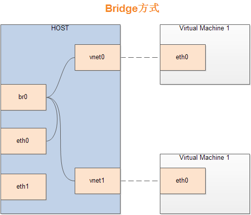

# ubuntu1604安装kvm

公司用*8核32g内存单网卡*台式做服务器，装的ubuntu16.04，为了方便开发测试，计划在其部署2个kvm实例，步骤如下。

- [安装kvm](#install_kvm)
- [设置桥接](#bridge_set)
- [安装镜像](#install_img)
- [复制镜像](#clone_img)
- [启动镜像](#start_img)
- [增加内存](#alert_memory)
- [增加硬盘](#alert_disk)
- [控制台连接](#start_console)

## 安装kvm

参考:[Ubuntu 16.04 安装使用 KVM](http://blog.topspeedsnail.com/archives/8573)

~~~bash
#在开始安装KVM之前，我们需要确保CPU支持VMX/SVM硬件虚拟化。
$ egrep -c '(vmx|svm)' /proc/cpuinfo
#如果输出大于等于1，表示系统可安装KVM。如果输出为0，表示系统不支持KVM。

#安装KVM
$ sudo apt-get install qemu-kvm libvirt-bin virtinst bridge-utils cpu-checker

#安装确认
$ kvm-ok
INFO: /dev/kvm exists
KVM acceleration can be used
#如果不成功，一般会提示进入 bios 开启 VT 支持
~~~

## 设置桥接

参考:[Ubuntu14.04+KVM配置虚拟机桥接（bridge）](https://blog.csdn.net/fieldoffier/article/details/48497833)

参考:[Ubuntu开发环境搭建](https://www.leolan.top/index.php/posts/193.html)

参考:[ubuntu使用桥接模式无法连接网络的问题](https://blog.csdn.net/zhongyoubing/article/details/71081464)

Bridge方式即虚拟网桥的网络连接方式，是客户机和子网里面的机器能够互相通信。可以使虚拟机成为网络中具有独立IP的主机。
桥接网络（也叫物理设备共享）被用作把一个物理设备复制到一台虚拟机。网桥多用作高级设置，特别是主机多个网络接口的情况。

~~~bash
vim /etc/network/interfaces

# interfaces(5) file used by ifup(8) and ifdown(8)
auto lo
iface lo inet loopback

auto enp2s0
iface enp2s0 inet manual

auto br0
iface br0 inet static
    address 192.168.199.122
    netmask 255.255.255.0
    gateway 192.168.199.1
    bridge_ports enp2s0

dns-nameservers 8.8.8.8
~~~

## 安装镜像

参考:[Create Virtual Machine#1](https://www.server-world.info/en/note?os=Ubuntu_16.04&p=kvm&f=2)

参考:[Ubuntu 16.04设置rc.local开机启动命令/脚本的方法](https://www.linuxidc.com/Linux/2017-09/147166.htm)

字符模式下安装虚拟机，并用终端登录，因为是网络安装，速度有些慢
~~~bash
root@dlp:~# apt-get -y install libosinfo-bin libguestfs-tools virt-top

# create a storage pool
root@dlp:~# mkdir -p /var/kvm/images 
root@dlp:~# virt-install \
--name template \
--ram 4096 \
--disk path=/var/kvm/images/template.img,size=20 \
--vcpus 1 \
--os-type linux \
--os-variant ubuntu16.04 \
--network bridge=br0 \
--graphics none \
--console pty,target_type=serial \
--location 'http://jp.archive.ubuntu.com/ubuntu/dists/xenial/main/installer-amd64/' \
--extra-args 'console=ttyS0,115200n8 serial'

Starting install...     # installation starts

# after installation, back to KVM host and shutdown the guest like follows
root@dlp:~# virsh shutdown template 
Domain template is being shutdown

# mount guest's disk and enable a service like follows
root@dlp:~# guestmount -d template -i /mnt 
root@dlp:~# ln -s /mnt/lib/systemd/system/getty@.service /mnt/etc/systemd/system/getty.target.wants/getty@ttyS0.service 
root@dlp:~# umount /mnt

# start guest again, if it's possible to connect to the guest's console, it's OK all
root@dlp:~# virsh start template --console 
Domain template started
Connected to domain template
Escape character is ^]

Ubuntu 16.04 LTS ubuntu ttyS0

ubuntu login:

# 修改 rc.local 文件头部 /bin/sh 修改为 /bin/bash
$ sudo vi /etc/rc.local
#!/bin/bash -e
#
# rc.local
...
~~~

## 复制镜像

参考:[kvm 虚拟化 virt-clone 克隆虚拟机](https://blog.csdn.net/wanglei_storage/article/details/51106096)

~~~bash
＃另起一个 console 关闭 template
$ sudo virsh shutdown template
$ sudo virt-clone --connect=qemu:///system -o template -n ubuntu_kvm_1 -f /var/kvm/images/ubuntu_kvm_1

~~~

### 启动镜像

~~~bash
# 设置自动启动
$ sudo virsh autostart ubuntu_kvm_1

# 关闭自动启动
$ sudo virsh autostart --disable ubuntu_kvm_1

# 控制台登录 修改 ip 为静态
$ sudo virsh start ubuntu_kvm_1 --console
# 结束直接关闭窗口
~~~

### 增加内存

参考:[CentOS7.1 KVM虚拟化之虚拟机内存、CPU调整(6)](https://blog.csdn.net/hnhuangyiyang/article/details/50902223)

~~~bash
$ sudo virsh edit ubuntu_kvm_1
......  
  <memory unit='KiB'>1048432</memory>  
  <currentMemory unit='KiB'>1048432</currentMemory>  
  <vcpu placement='static'>2</vcpu>  
......  
~~~

### 增加硬盘

参考:[给KVM虚拟机增加硬盘](http://blog.fens.me/vps-kvm-disk/)

参考:[linux挂载新硬盘,开机自动挂载](https://my.oschina.net/wukongcelebrity/blog/377363)

~~~bash
$ sudo qemu-img create -f raw /var/kvm/HD500.img 500G
...

$ sudo virsh edit ubuntu_kvm_1

#找到硬盘配置(原来的系统硬盘)
<disk type='file' device='disk'>
<driver name='qemu' type='raw'/>
<source file='/disk/sdb1/c1.img'/>
<target dev='vda' bus='virtio'/>
<address type='pci' domain='0x0000' bus='0x00' slot='0x04' function='0x0'/>
</disk>

#增加文件硬盘,vdb 保持 slot 与 其它 slot 不一样即可
<disk type='file' device='disk'>
<driver name='qemu' type='raw' cache='none'/>
<source file='/var/kvm/HD500.img'/>
<target dev='vdb' bus='virtio'/>
<address type='pci' domain='0x0000' bus='0x00' slot='0x06' function='0x0'/>
</disk>

#保存退出

$ sudo virsh start ubuntu_kvm_1 --console

# 使用 fdisk 对硬盘进行分区
$ sudo fdisk /dev/vdb

Command (m for help): n
...
Select (default p): p
...
Command (m for help): w
...

# 分区生效
$ sudo partprobe

# 格式化分区
$ sudo mkfs -t ext4 /dev/vdb1

# 获取 UUID
$ ls -l /dev/disk/by-uuid

# 新建挂载目录
$ sudo mkdir /mnt/HD500

# 自动挂载
$ sudo vi /etc/fstab

# /etc/fstab: static file system information.
#
# Use 'blkid' to print the universally unique identifier for a
# device; this may be used with UUID= as a more robust way to name devices
# that works even if disks are added and removed. See fstab(5).
#
# <file system> <mount point>   <type>  <options>       <dump>  <pass>
# / was on /dev/vda1 during installation
UUID=f688b2c6-90a4-4706-9691-799dc521e489 /               ext4    errors=remount-ro 0       1
UUID=1bc194e0-3306-4cb3-86d3-2c0ecd3ac2e7 /mnt/HD500               ext4    errors=remount-ro 0       0
# swap was on /dev/vda5 during installation
UUID=3e8161af-b208-4bbd-8480-9c9ed4c734cd none            swap    sw              0       0

#保存退出
~~~

### 控制台连接

参考:[KVM/Access](https://help.ubuntu.com/community/KVM/Access)

~~~bash
# 启动镜像时进入
$ sudo virsh start ubuntu_kvm_1 --console

# 已经启动的镜像
$ sudo virsh console ubuntu_kvm_1
...
连接到域 ubuntu_kvm_php
换码符为 ^]

# 重点:
# 此处再按一次回车进入控制台
# 按 ctrl+] 退出控制台
~~~

